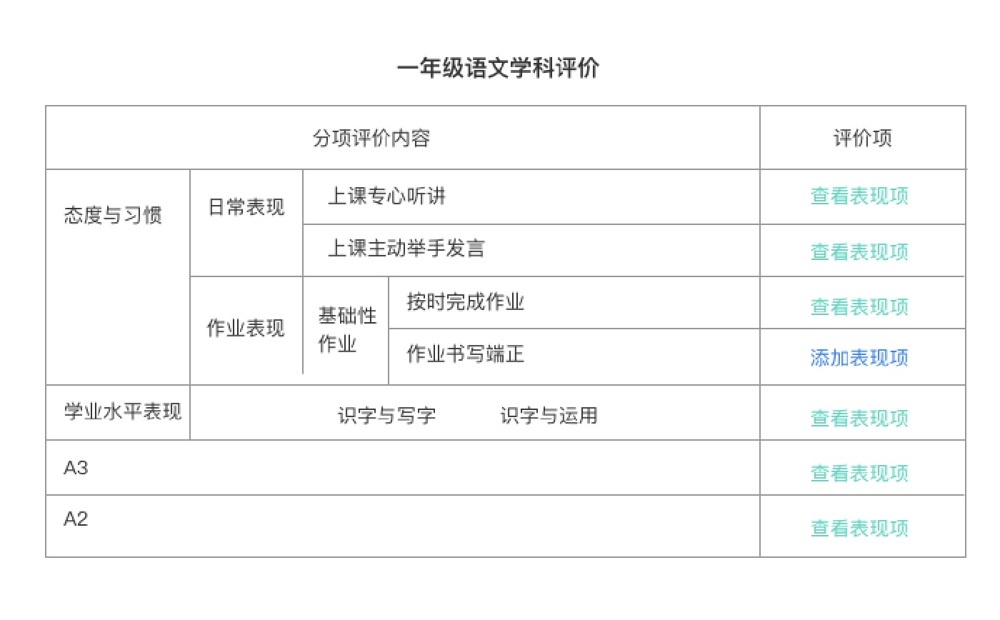
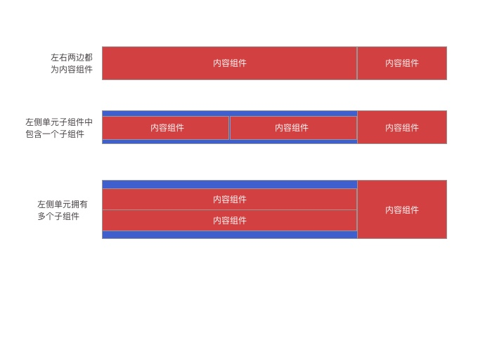
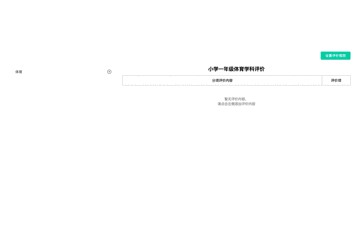

## Vue&React 框架下仿 Word 表格组件

> 产品经理和设计师的脑洞总是千奇百怪的，最近产品经理根据项目开发提出了一个需求。想要在 Web 端增加一个 word 那样的表格，并且这个表格还需要增删改。

#### 产品图



内容如上图这般。不仅能够为每一项添加一个表现项或者查看表现项，还需要能够添加一项或者减少一项又或者修改某一项的内容。

#### 分析

初看表格本打算使用 Element-Ui 中的表格实现(一个同事用相关对组件确实也实现了相似的 demo)，但是考虑到如果使用 Element-Ui 那么势必需要对后台传入的数据进行一层操作。
因为从图上看不管怎样这个数据都是一个树状结构的。并且我们需要能够对表格进行一些操作。

谷歌了一番是否有相应的插件，也并未如愿。本想使用 js 版的 excel 来尝试一下。但是发现那个展示和我们的设计稿不同，并且功能太多，为了这个内容增加一个庞大的插件显然没有必要。

于是乎，打算自己造轮子！！

#### 拆分

首先数据结构上，完完全全是一个树状结构。而且需求是需要增删改，那么直接拿上一手的 Element-Ui 中的 Tree 组件。将需要的增删改操作放在 Tree 组件中进行操作。剩下的就只有一个普通的表格展示了。

既然自己绘制这个表格，数据自然需要和 Tree 组件一样，这样就不需要为了渲染展示而去处理数据层了。

#### 原理

表单在渲染上，其实和 tree 的思想一样。我们可以简单的将表单理解为左边和右边两个单元。每个单元会存在两种组件中的其中一种，要么纯粹展示内容的组件，要么作为容器去创建左右两个单元的容器组件。而容器组件也存在一个或者多个的情况，即多个进行垂直平分父层容器。

大致有如下几种情况：


基于如上，我们可以直接上递归进行渲染，首先是内容组件:

```
// c-content.vue 组件

<template>
  <div
    class="c-content c-container"
    :style="'min-width:'+width+'px;max-width:'+width+'px'"
    v-if="content!==''"
  >{{content}}</div>
  <div class="c-content" :style="'min-width:'+width+'px;max-width:'+width+'px'" v-else>
    <slot :slotData="node">评价项</slot>
  </div>
</template>
```

内容组件中，要么渲染出最后的数据传递下来的展示文字；要么通过 slot 方式传递进额外的操作内容。插槽默认展示评价项的展示。

```
// c-tree-table.vue 组件

<template>
  <c-content :class="border?'c-tree-table':''">
    <div class="c-row" v-for="(item,index) in node" :key="index">
      <template v-if="item.children.length>0">
        <c-content :content="item.label" :width="leftCellWidth" />
        <c-tree-table
          :node="item.children"
          :leftCellWidth="leftCellWidth"
          :rightCellWidth="rightCellWidth"
          :isShowRightCell="isShowRightCell"
        >
          <template slot-scope="slotProps">
            <slot :slotData="slotProps.slotData"></slot>
          </template>
        </c-tree-table>
      </template>
      <template v-else>
        <c-content :content="item.label" />
        <c-content :width="rightCellWidth" :node="item" v-if="isShowRightCell">
          <slot :slotData="item"></slot>
        </c-content>
      </template>
    </div>
  </c-content>
</template>
```

容器组件中，最外层当然是一个内容组件通过 slot 来展示内部元素结构。因为考虑到可能曾在多个子集，所以需要通过遍历对它们进行垂直渲染。而在渲染子集的时候，也需要通过判断子集是否拥有子集组件，若有则进行递归，若没有则渲染内容组件。(可能描述的不清楚，大家可以去 github 下载 demo，跑一下=。=)

#### 注意事项

在进行样式调整的时候，我这里使用 div 一把梭，当然可以使用 table 相关标签，只是我用的不习惯。另外关于两个 div 之间的边框相叠加的问题，这里使用了-1px 的操作，让其进行偏移了。具体可以去 github 上看一下。

#### 成品



以上内容便是我们最后对成品了。
